# Ubuntu Server Setup
## Objectives
Ubuntu Server in my lab will be used for everything from hardeninn and scripting to networking and attack simulations. Ideal for experimentaions. The following objectives for this workshop are:
* Download Ubuntu Server ISO file.
* Do preinstallation configuration and perform the installation.
* Set a static IP address so it can communicate with other VMs on the same subnet range.

## VM Overview
|            |            |
|------------|------------|
| OS Name    | Ubuntu Server |
| Purpose    | Server/Target |
| Base OS    | Linux -> Debian (64-bit) |
| Installed On | VirtualBox 7.1.4 |
| Resources Allocated | 1 CPUs, 2 GB RAM, 30 GB Disk |
| Network Node | Internal Network (LabNet), NAT |

## Installation Process
### File Download
* Source: [Download Ubuntu Server](https://ubuntu.com/download/server)
* ISO File: ubuntu-24.04.2-live-server-amd64.iso

### Virtual Machine Configuration
* Hypervisor: VirtualBox
* Name: ubuntu_server_24.04.2_amd64
* Type: Ubuntu (64-bit)
* Base Memory: 2048 MB
* CPUs: 1
* Network Adaptor: NAT (For updating and installing additional packages) | Internal Network (For LabNet network)
* Hard Disk: 30 GB VDI (dynamically allocated)

### Screenshots
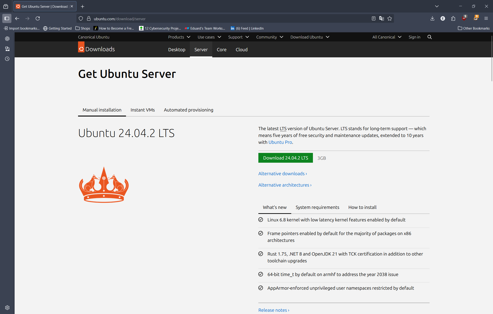

Ubunut Server can be installed from an official website. Just click to download a lates version.

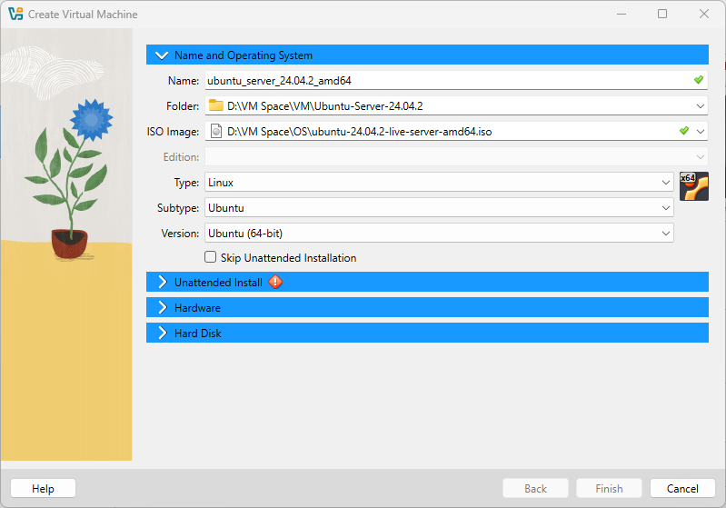
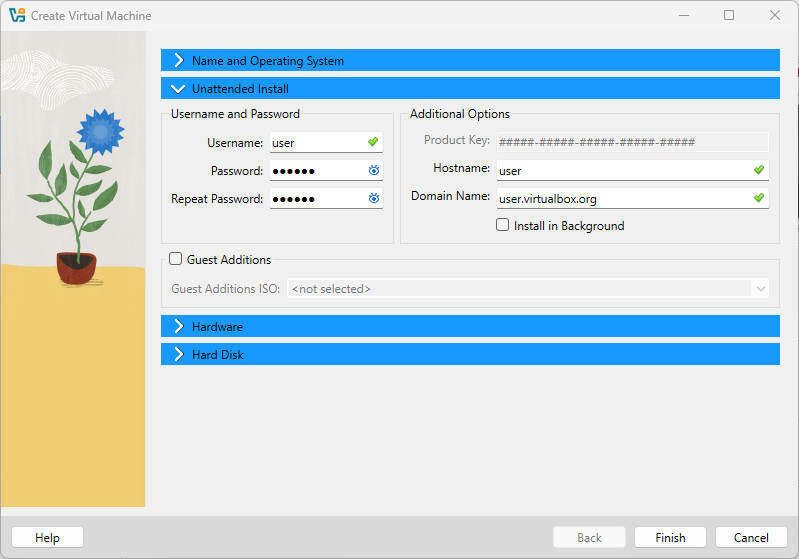
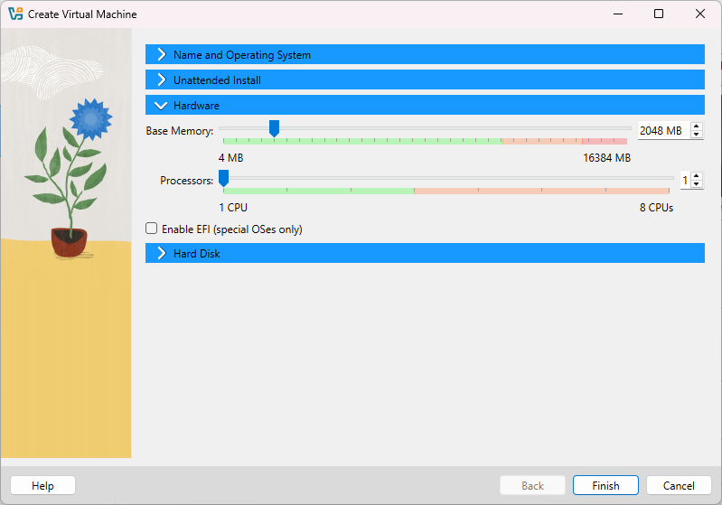
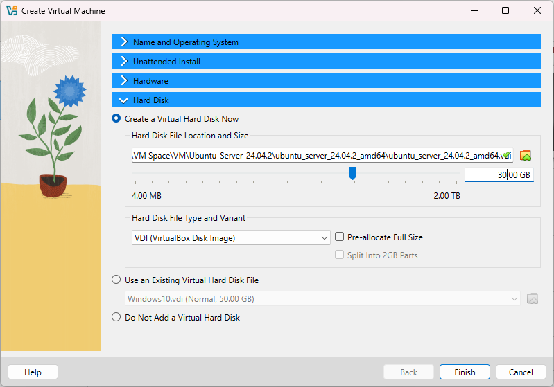

In the VirtualBox create a new VM, select the ISO file of your ubuntu server.

To make installation much more easier we can configure it before we actually create a VM.

Since ubuntu server doesn't require a lot of system resources, we can CPU to 1, give 2 GB of memory. However, I gave 30 GB of storage since I will be installing alot of new packages for it when doing OS hardening and other lab works.

Don't forget to change the username and password.

Once everything is configured, press finish and it should be ready to start.

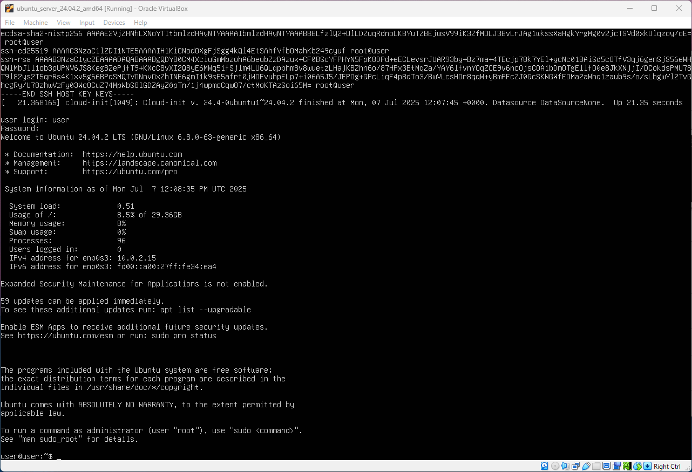

When you start ubuntu server it will ask you to log in. Also in this stage it can show any errors.

#### Set static IP address
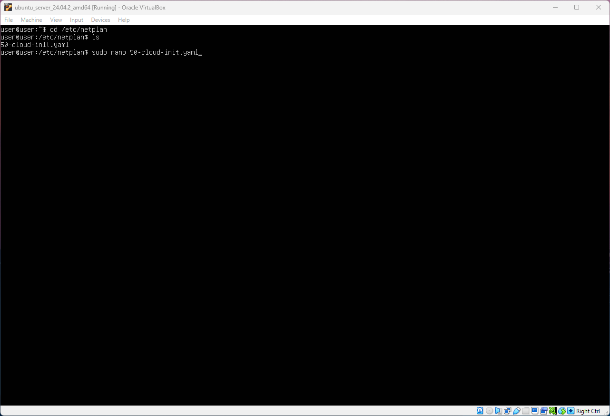

To change static IP address, we need to navigate to /etc/netplan directory. It will contain a .yaml file. The name of this file may be different to each system.

/etc directory contains all the configuration files including configurations for network.

To edit .yaml file use the following command: sudo nano name_of_your_file.yaml

Make sure to use root privilages as it will allow you to make changes to the file.

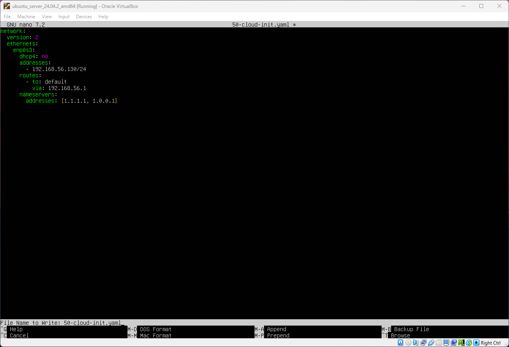

To set a static IP address is easy, set DHCP to no and add addresses, routes and nameservers as the image shows. Of course adjust your IP address to match your lab subnet range.

To save the file press "ctrl+x" and then press y.

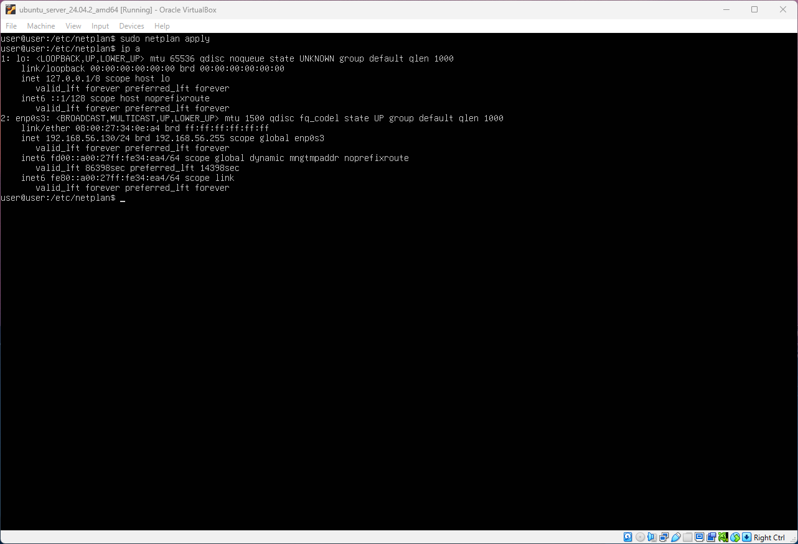

Once the file is saved we need to apply the changes by running the following command: sudo netplan apply

At this stage it can also show some errors if your configuration is not correctly done.

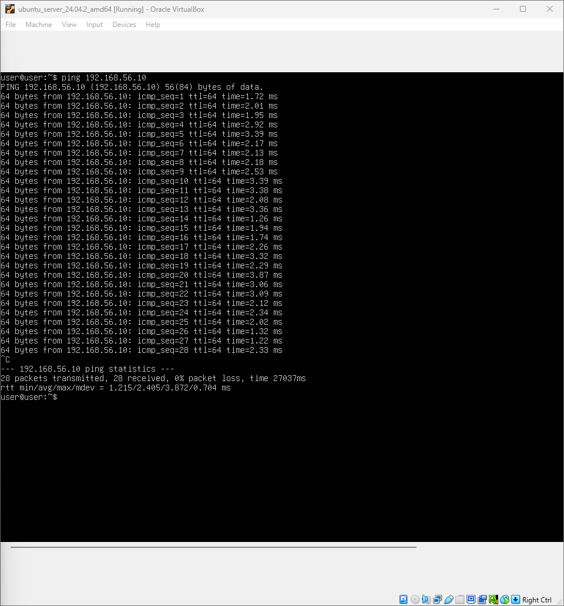
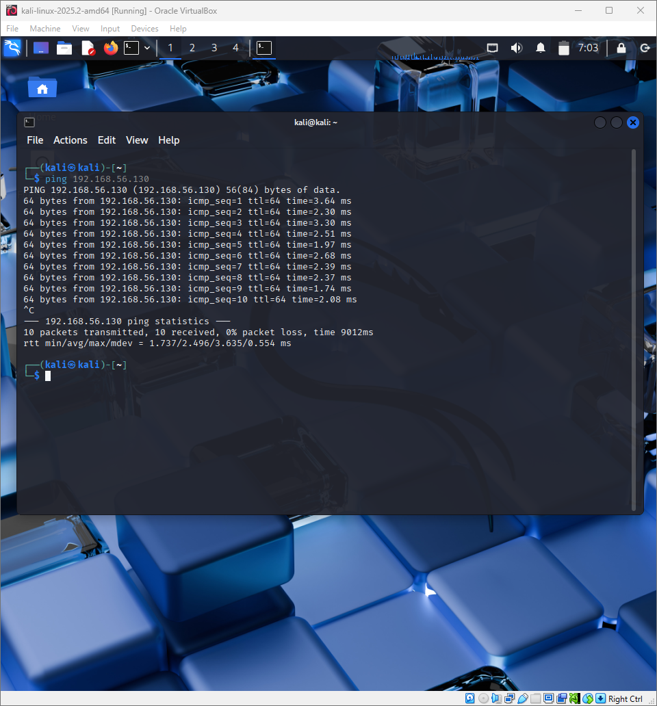

To check if both VMs can communicate, I ran Kali Linux along side with Ubuntu server.

Both machines needs to be set to Internal Network.

If both machines can ping each other then that means networking configuration is working correctly.

