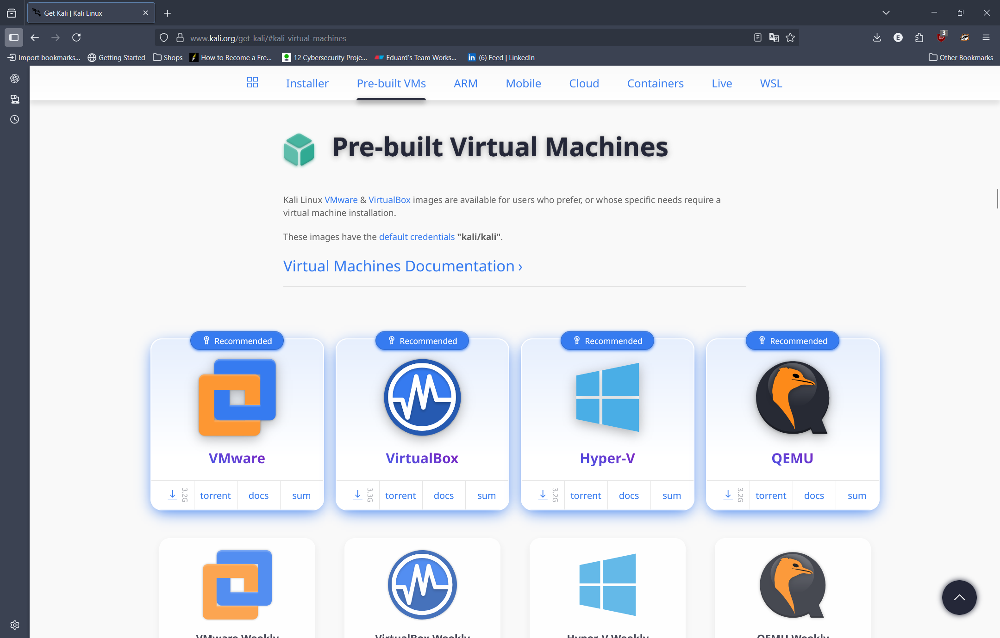
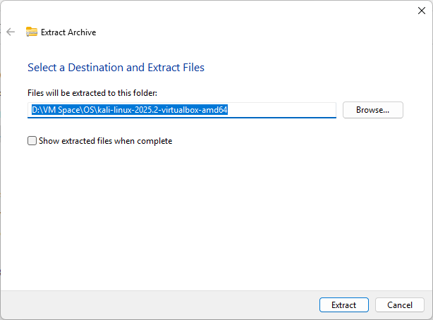
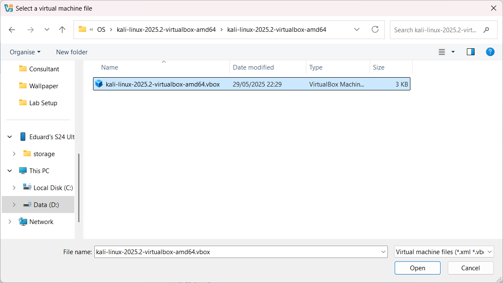
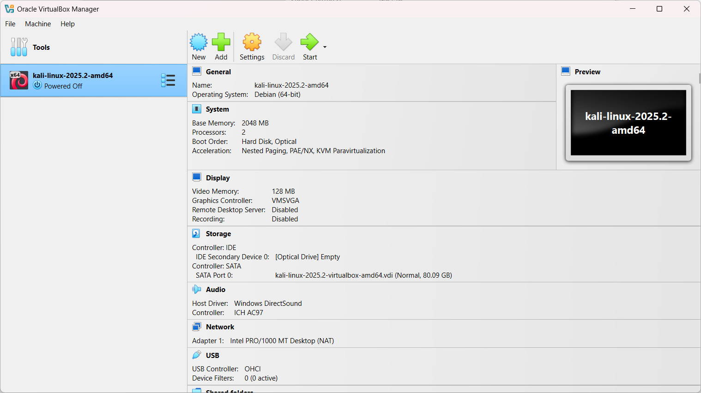
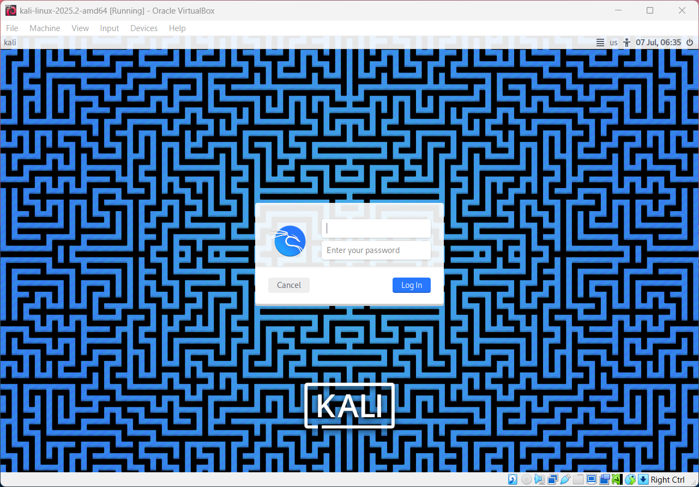
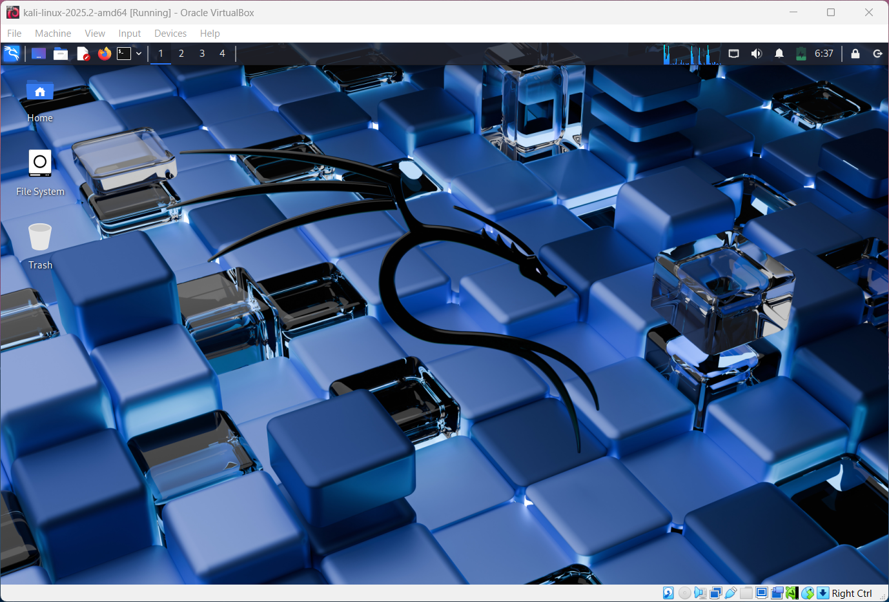
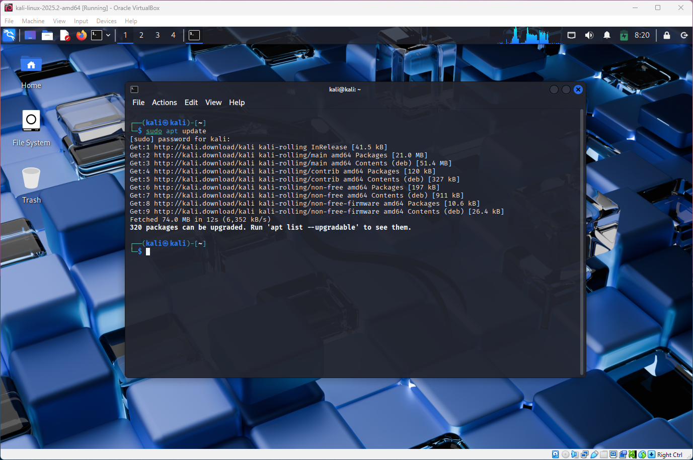
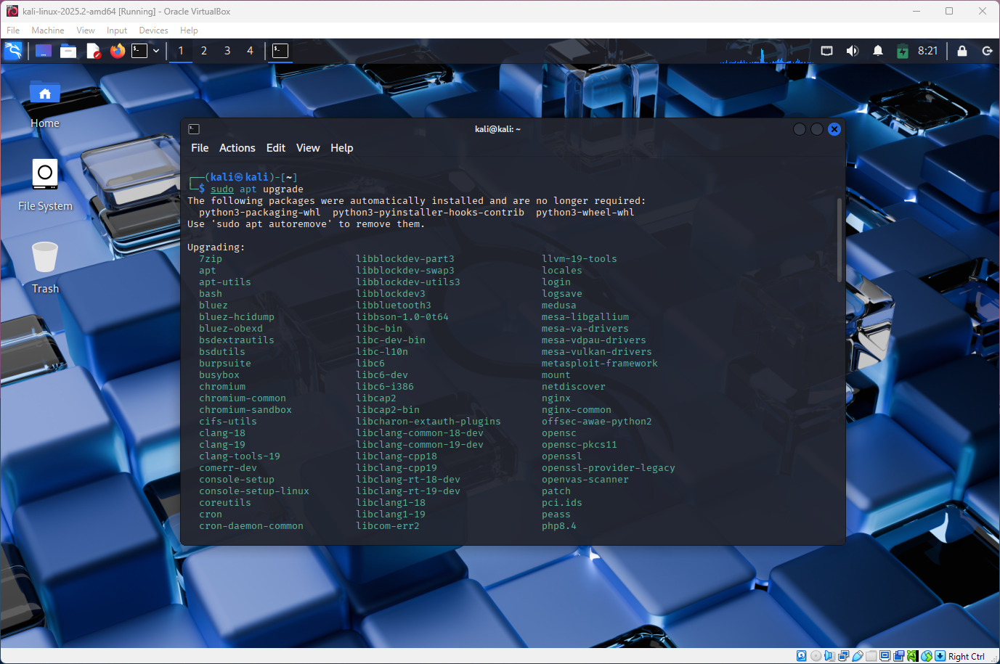
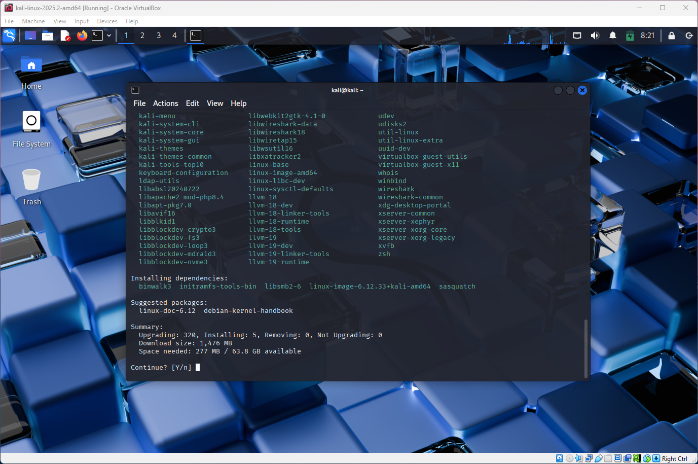
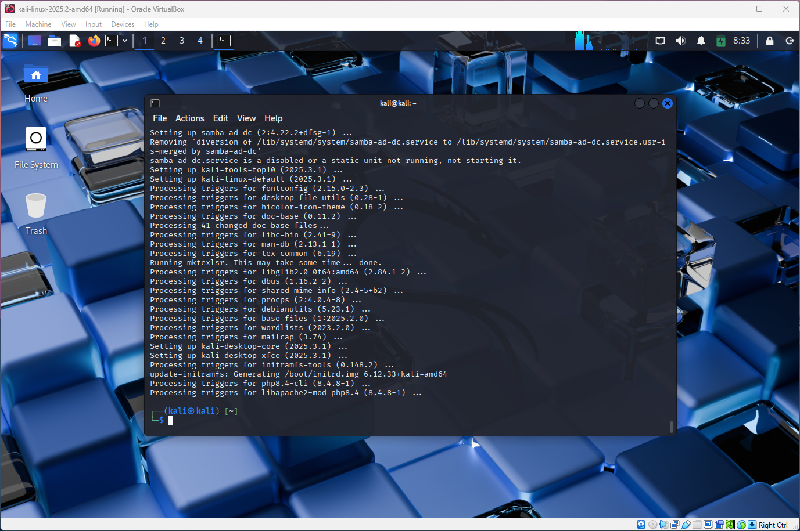

# Kali Linux Setup
## Objectives
Setting up Kali Linux VM is a part of setting a cyber security lab. It will be used to simulate an attacker/offensive security. In this document it will show the process of installing Kali Linux VM and how to boot it up. In addition, at the end of the document it will show how to configure static IP address.
* Download Kali Linux VM file
* Configure VM before installing and booting up the Kali Linux
* Update the systems packages using update & upgrade
* Configure lab network (static IP address)

## VM Overview
|            |            |
|------------|------------|
| OS Name    | Kali Linux 2025.02 |
| Purpose    | Attacker/Offensive Security |
| Base OS    | Debian-based Linux |
| Installed On | VirtualBox 7.1.4 |
| Resources Allocated | 2 CPUs, 2 GB RAM, 30 GB Disk |
| Network Node | Internal Network (LabNet), NAT |

## Installation Process
### File Download
* Source: [Download Kali Linux](https://www.kali.org/get-kali/#kali-virtual-machines)
* VIM File: kali-linux-2025.2-virtualbox-amd64.vim

### Virtual Machine Configuration
* Hypervisor: VirtualBox
* Name: Kali_Linux_2025.2
* Type: Linux -> Debian (64-bit)
* Base Memory: 2048 MB
* CPUs: 2
* Network Adaptor: NAT (For updating and installing additional packages) | Internal Network (For LabNet network)
* Hard Disk: 30 GB VDI (dynamically allocated)

### Screenshots
#### 1. Dowloading File and Installing Kali VM

The official Kali Linu website provides different intallation files of kali linux based on what virtualisation software you are using. In this case I am choosing VirtualBox option. Press download and it should install latest version for you.

Most likely it will be installed in a zip file, just extract the contents into the choosen folder.

Inside the virtualisation software, like VirtualBox, use the option to add a new VM. Select the VM file that was extracted.

Before installation, it will allow you to configure settings for the new VM. The configurations for this VM is listed above.

Once everything is installed, the new Kali Linux VM will be ready to start.

Using this method to install Kali Linux, username and password will be set to "kali". Both usernames and passwords can be changed later on.

If everything done right, you should be able to log into the system.

#### 2. Updating & Upgrading Kali Linux

"apt update" is used to refresh the package list for Linux system. Its essential to perform this once in a while to make sure your systems keeps up to date. Once the command is used it will display any packages that fetched from the web.

"apt upgrade" is used to install the latest versions of the installed packages. Before this command can be used, "apt update" needs to be executed first.

During installation stage, it will list all the packages that needs to be installed and ask if you want to proceed. Just enter "y" to continue.

Terminal can be closed once installation is complete.

