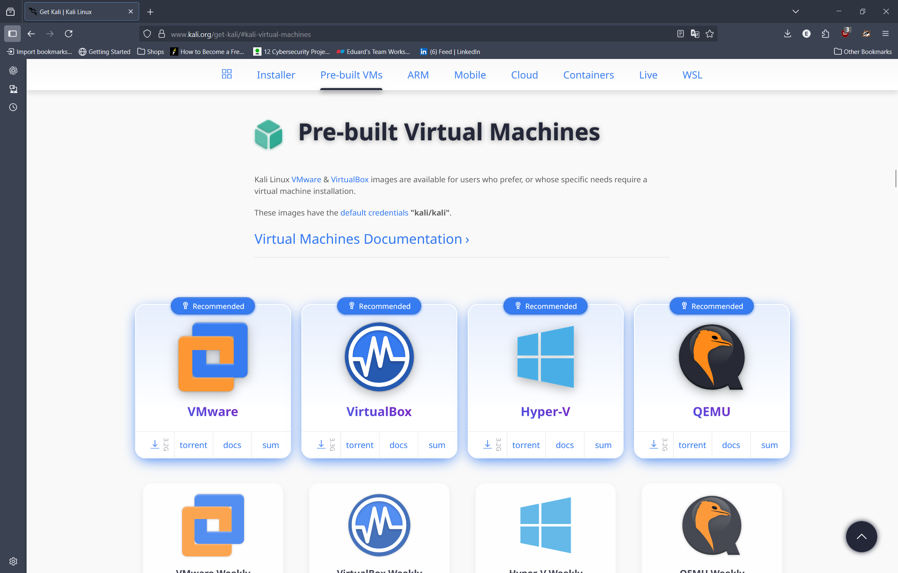
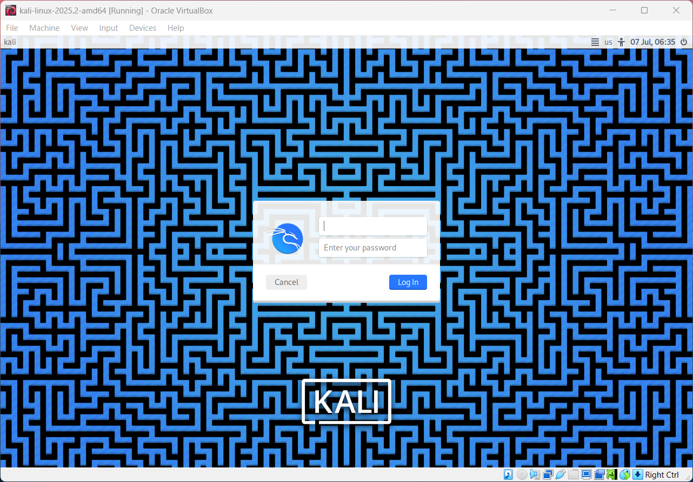
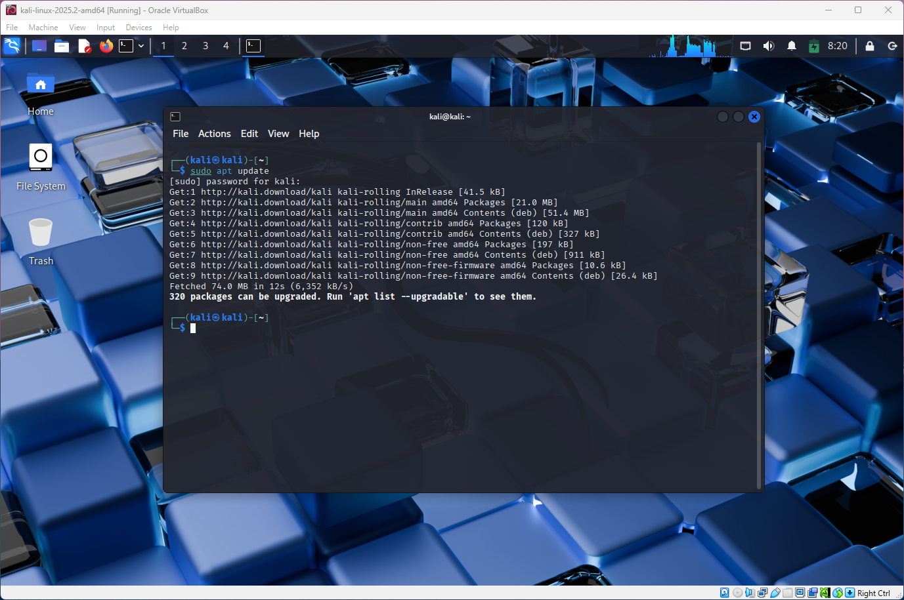
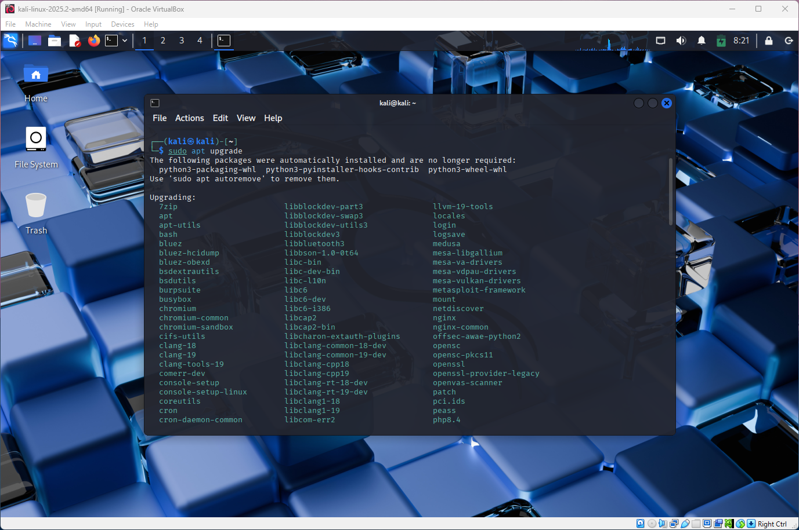
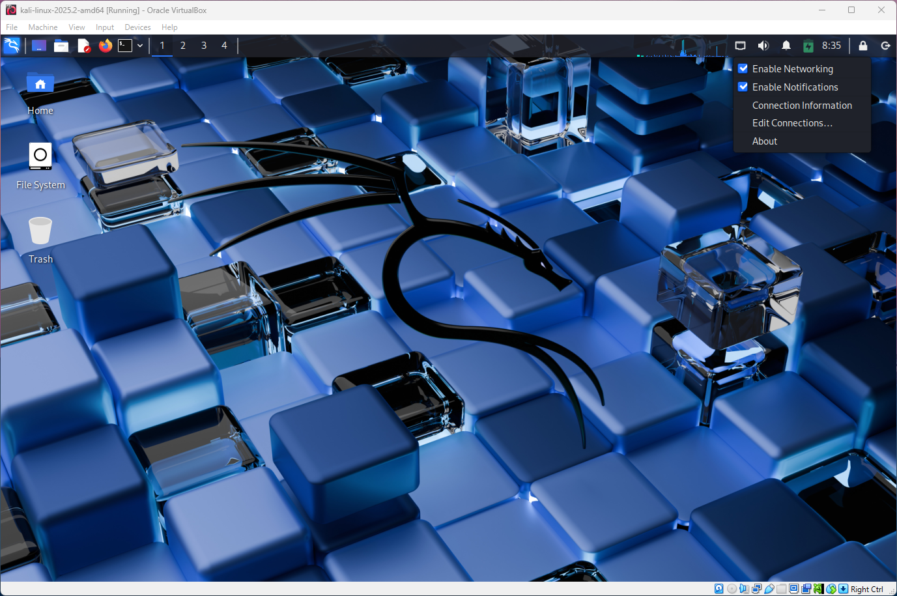
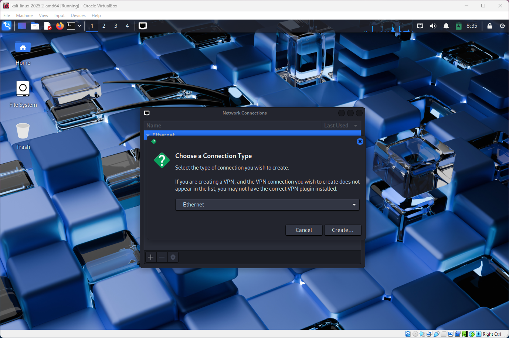
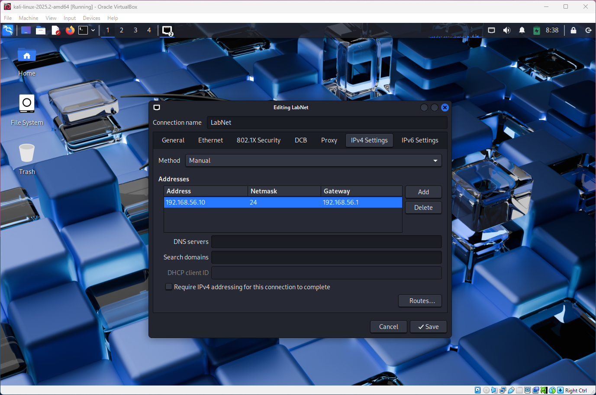
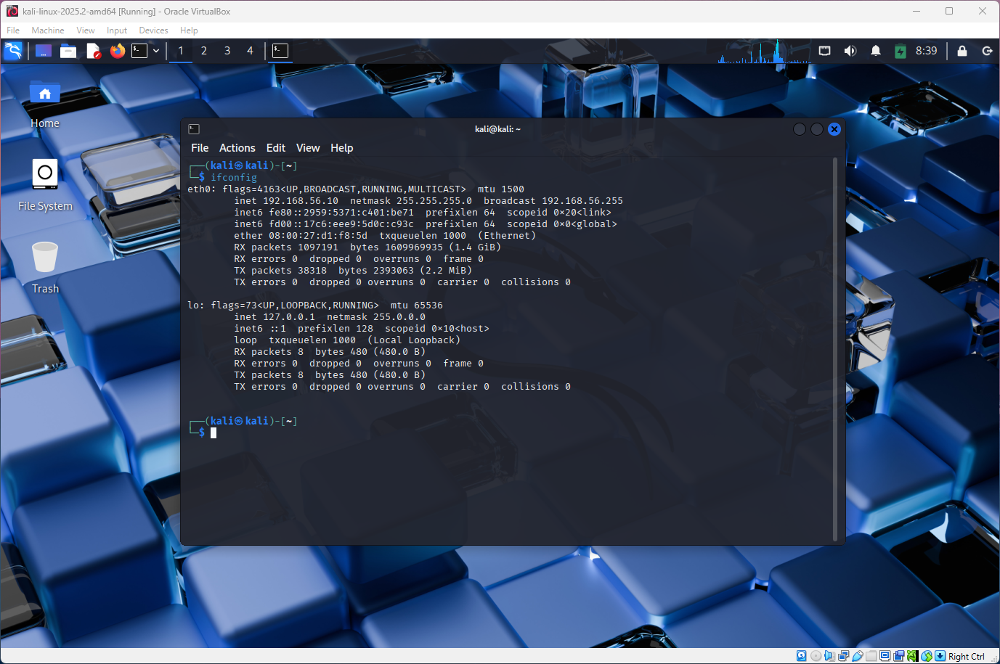

# Kali Linux Installation
In this project the Kali Linux will be installed and configured for the future use in this lab environment. Kali Linux itself contains huge variety of tools that allows to perform penetration testing and ethical hacking, which means it doesn't require a lot of installations of additional packages.

## Objectives
* Download Kali Linux VIM file
* Install and Configure Kali Linux virtual machine
* Update the systems packages
* Configure static IP address

## VM Overview and Configurations

| Sections         | Description                        |
|------------------|------------------------------------|
| Purpose          | Attacker/Offensive Security        |
| Base OS          | Debian-based Linux                 |
| Processor        | 2 CPUs                             |
| Memory           | 4096 MB                            |
| Hard Disk        | 30 GB VDI (Dynamically Allocated)  |
| Network Adaptor  | NAT                                |
| Installed On     | VirtualBox 7.1.4                   |
| Hypervisor       | VirtualBox                         |
| Name             | Kali_Linux_2025.2                  |

## Installation Process
The Kali Linux installation image can be downloaded from official website: [Download Kali Linux](https://www.kali.org/get-kali/#kali-virtual-machines). On the official website it will contain multiple versions for different virtualisation softwares. In this example, VirtualBox version will be downloaded.

The installation file will be downloaded as a ZIP file, containing 2 files. Inside the VirtualBox press 'New' and select the '.vbox' file for Kali Linux. The essential installation and configurations will be automatic. However, before starting Kali Linux VM, go to settings and change the processor and memory. Since Kali Linux contains GUI and will be performing many operations, allocate more memory and processors to it.

Once the Kali Linux VM boots up it will prompt for username and password. The defult username and password are 'Kali' and 'Kali'. If defult username and password doesn't work, check the manual for your version on the official website.

### Update & Upgrade
To make sure to get latest tools for Kali Linux, its recommended to update and upgrade any packages one in a while. If updating the packages haven't been done for a long time it can cause issues, to prevent that make sure to update and upgrade packages at least once a month :)

To update the list of packages use the following command: **sudo apt update**

To actually install those packages on the system use the following command: **sudo apt upgrade**

For the first time it may take quite a while to upgrade everything.

### Static IP Configuration
To configure static IP address navigate to the taskbar on the top. On the right side it should contain a icon represention ethernet port. Right click on the icon and select 'edit connections...'.

It will open a menu where already created connection can be modified, however, a new connection will created. To do so press on the plus icon on the bottom left. It will prompt which connection to create, choose ethernet connection and proceed to next step.

Inside the configuration of the new connection type, navigate to IPv4 settings and ignore other sections. Inside the IPv4 settings set IP address, netmask and gateway. Also set the method from DHCP to manual since it needs to be a static IP address. Also change the name of the connection to any desired names. Then click save.

To check if the new connection type works, select the connection type. Then open terminal and type ifconfig. The interface eth0 should contain the configured static IP address. If it does then the configuration was successful.

