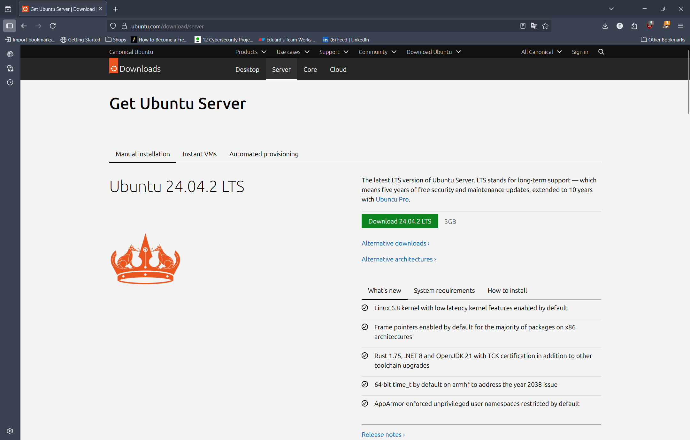

# Ubuntu Server Installation
Ubuntu Server simulates a real-life server, hosting websites and services required for the lab environment. It is designed to be vulnerable to simulated attacks and offensive security testing.

## Objectives
* Download the Ubuntu Server ISO image
* Install and configure the Ubuntu Server virtual machine
* Configure a static IP address to support the simulated network environment
* Ping other virtual machines on the lab network.

## VM Overview and Configuration
| Section      | Description                  |
|--------------|------------------------------|
| Purpose      | Server                       |
| Base OS      | Ubuntu (based on Debian      |
| CPU          | 1 CPU                        |
| Memory       | 2048 MB                      |
| Hard Disk    | 30 GB                        |
| Network Mode | NAT                          |
| Installed On | VirtualBox 7.1.4             |
| Hypervisor   | VirtualBox                   |
| Name         | ubuntu_server_24.04.2_amd64  |

## Installation Process
The Ubuntu Server ISO image can be downloaded from the official website: [Download Ubuntu Server](https://ubuntu.com/download/server). Click 'Download' download button, as shown bellow. The ISO image is approximately 3 GB in size.

Next step is to configure the Ubuntu Server virtual machine before installation. It will prompt to enter Name and select the ISO image. In addition, settings like hardware and hard disk space can be configured too. For this example, unattended install will be selected.

> [!Warning]
> Don't forget to enter a new username and password for this machine, located in 'Unattended Install' section.

The Ubuntu Server doesn't require a lot of system resources. However, allocate more space to hard disk to allow future installation of additional modules and creation of files.

Once configuration is finished, press on 'finish' button and it will make the installation.

Once the Ubuntu Server virtual machine boots up, using the configured username and password, login into the system.

### Configuring static IP address (Optional)
Configuring static IP address process can be skipped for now. NAT access needs to be enabled for OS hardening since additional modules and packages needs to be installed.

To actually setup static IP address navigate to 'etc/netplan' directory which will contain a '.yaml' file. Its a configuration file for ubuntu machines, for normal users this file is accessible in read only mode. To edit network configuration file use 'sudo nano ....yaml' (other editors like vim can be used too). 

Inside the file set the following parameters:
- dhcp4: no
- addresses: x.x.x.x/24
- routes: to: default, via: x.x.x.1
- nameservers: addresses: [x.x.x.x, x.x.x.x]

The example of the full structure for .yaml file is shown below.

To save the document press 'Ctrl+X' and 'Y' to save and exit.

To apply the network changes, use the following command: 'sudo netplan apply'. 

To test if the new network configuration has been applied use 'ip a' to display network interfaces. The second interface will show the configured static IP address.

To allow communications with other virtual machines on the same subnet, change the network adapter to 'Internal Network' located inside the virtual machines settings. Note that other virtual machines needs to be on the same subnet and have same adapter settings selected.
