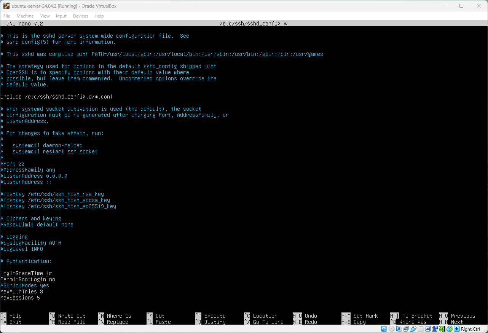
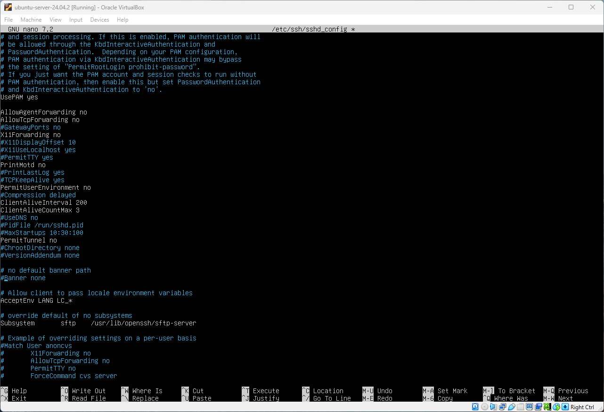
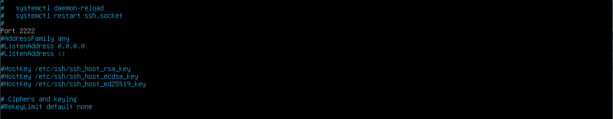
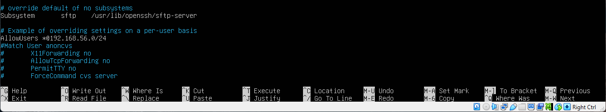
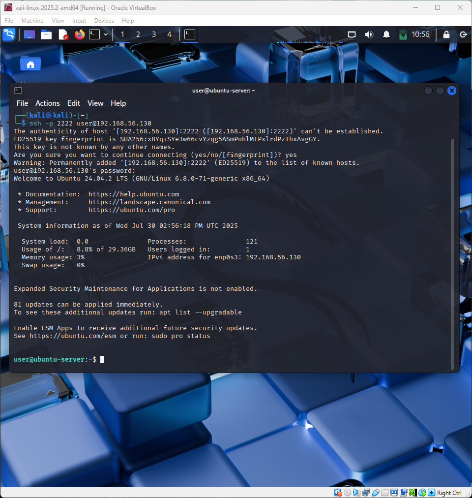
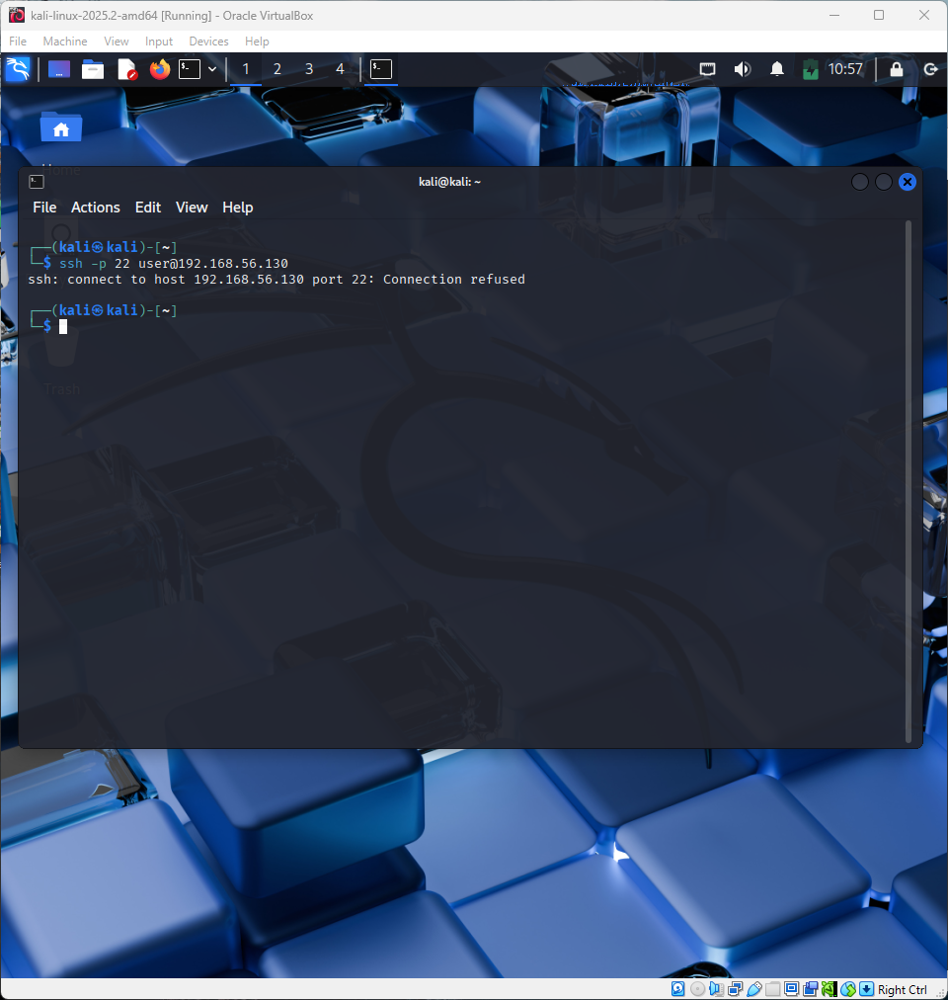
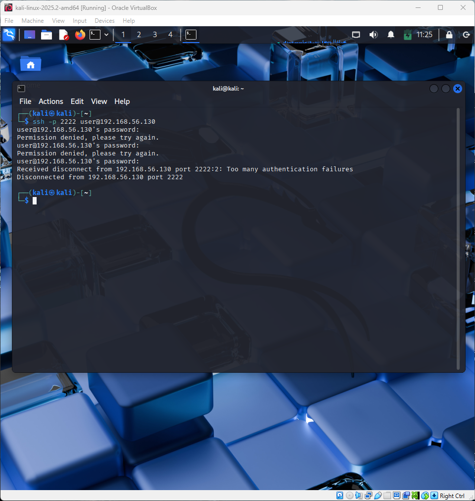
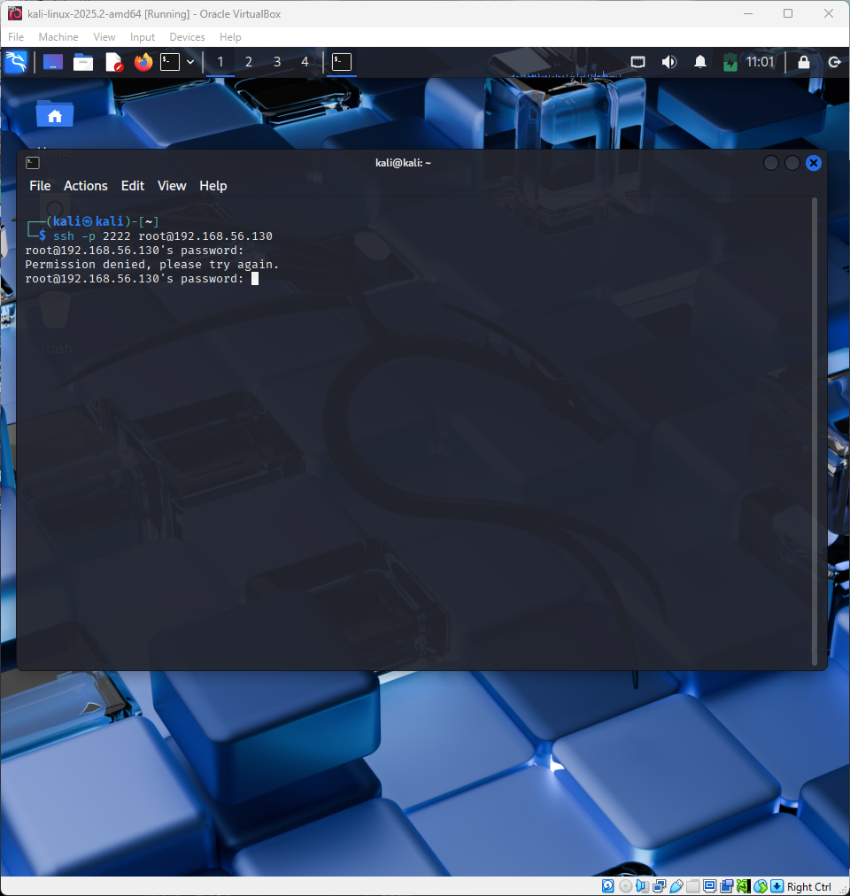

# Securing SSH Connection
Secure Shell (SSH) is a network protocol that allows a secure remote access and management of computers over unsecure network. It provides encrypted connection for better security. The counter part to SSH is Telnet network protocol that is not secure and doesn't any encryption. While SSH does provide better security, it doesn't mean its completely safe. To reduce attack vector, several configurations needs to be made. If your system doesn't have openssh-server preinstalled, then use command:
> sudo apt install openssh-server

## Backup default config file
Before making any changes to the ssh config file, make sure that the default configurations have a backup just in case if new configurations break the ssh service. Its a good practice to backup any configuration file before making major changes. To do so run the following command:
> sudo cp /etc/ssh/sshd_config /etc/ssh/sshd_config.bak

## Editing Config File
To make SSH more secure, navigate to /etc/ssh/sshd_config file. Any editor can be used to edit this file. It does require escalated privilages, so using sudo command is required to save any changes.
> sudo nano /etc/ssh/sshd_config

Inside the file change the following settings:
* LoginGraceTime 1m - This sets the time limit on how long it allows to spend time login in.
* PermitRootLogin no - Root user account access should not be allowed through ssh connection, forces users to use sudo command.

To prevent DDOS Attacks make sure the following settings are set (shown below), however, these settings values can be changed to suit your business/system needs.
* MaxAuthTries 3 - This can be increased or decreased based on your systems risk level. It sets the acceptable number of incorrect guesses.
* MaxSessions 5 - Sets the number of users that are allowed to use SSH connection at the same time.

Next step is to make sure that empty passwords are not allowed. Set the following value:
* PermitEmptyPasswords no

Also change the following settings:
* AllowAgentForwarding no ---⌍ - These are optional, if your system doesn't use it then its better to disable it.
* AllowTCPForwarding no   ---⌏
* X11Forwarding no - Restricts to CLI and disables GUI support. If your server doesn't support it then disable it. 
* PermitUserEnvironment no - Doesn't allow users to create their own variables and paths.

In addition change the following settings:
* ClientAliveInterval 200 - Its used if client becomes idle, if the server doesn't receive anything it will send a message every 200 seconds. 
* ClientAliveCount 3 - Sets the number of times the message will be send to the user without getting any response back.

These two settings are important as it will log out any users that are idle for sometime. This reduces attack vector by protecting account from unauthorised access if someone forgot to logout.

To apply all the changes run the following commands:
> sudo systemctl daemon-reload

> sudo systemctl restart ssh.socket

> sudo systemctl start ssh

Now those changes can be checked by loging into machine through ssh connection.

## Change SSH port number
The defult SSH port number is 22. Its a good practice to change SSH port to some unused port numbers like 2222. Changing port numbers can reduce the risk but not completely, some scanning bots will tend to scan defult ports, however more advance bots may also perform scans on unused ports like 2222 to identify any services there. To change SSH port number navigate to /etc/ssh/sshd_config and set the following:
* Port 2222

Next step is to allow port 2222 in firewall. To do so run the following command:
> sudo ufw allow 2222/tcp

Also deny port 22 since it's not going to be used.
> sudo ufw deny 22/tcp

Now iptables needs to be updated:
> sudo /sbin/iptables -A INPUT -m state --state NEW -m tcp -p tcp --dport 2222 -j ACCEPT

Afterwards restart ssh service.

## Restrict all users to a specific IP address
The IP address I'm using is just an example, however it shows the format you need to follow when allowing certain IP addresses or ranges to use SSH connection. * is a wildcard and can mean any user.
> AllowUsers *@192.168.56.0/24

It sets a specific subnet range to be allowed to use SSH connection. Also sets that all users from that subnet range can use this service.

Save the file and reload the ssh service again.

## Test New Configurations
For this project, 4 tests will be conducted. Kali Linux Virtual Machine will be used as a user who wants to access Ubuntu Server remotely. Linux has an inbuilt ssh command that can be used to remotely access computer systems that allow SSH connections.

1) User is able to remotely connect to the server using SSH protocol and on 2222 port.

3) User cannot use port 22 to remotely connect to the server through SSH protocol.

4) User allowed to have maximum of 3 tries to login via SSH connection.

5) User cannot login as a root user through SSH connection.

